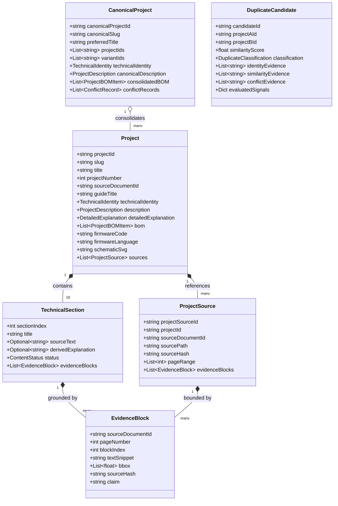

# EngineeringGuides: Project-First Architectural Specification (P02.3)

**Version:** 2.3.0
**Status:** Certified & Released (P02.3 Forensic Closure Final: IR-First Independent Discovery, Literal Evidence, Zero-Fabrication, Strict Dedup)
**Standard:** $1\ \text{Technical Project} = 1\ \text{Independent Entity}$

> **Note on the P02.2 claims below this line's predecessor:** the P02.2
> version of this document claimed 0 `MISSING_IN_IR` cases and boundary
> discovery "without artificial promotion" while `boundaries.py` actually
> received `keyProjects` as `catalog_hints` and used it to search Document IR
> for catalog titles and to cap the discoverable project-number range. See
> `docs/project-first/PROJECT_FIRST_CERTIFICATION_REPORT.md` Section 2 for the
> full list of confirmed P02.2 defects and their fixes.

---

## 1. Executive Summary & Architectural Evolution (P02.3)

**Prompt 02.3 — Forensic Closure Final** enforces genuine two-phase
independence between Document IR discovery and catalog reconciliation, and
replaces every per-module banned-phrase list with one shared source of truth:

1. **IR-First Independent Boundary Discovery:** `discover_projects_from_ir(ir, source_document_id, source_hash)` receives **no catalog input whatsoever** — no `keyProjects`, no title hints, no catalog-derived search-space limit. It matches exact Document IR markers (`[ P R O J E C T 0 1 ]`, `■ P R O J E C T 0 1`, `PROJECT 01`, `UPGRADE 01`, `#1`, `STEP 01`, `01 Name`) across all 31 documentary guides using a fixed structural ceiling. `reconcile_boundaries_with_catalog(...)` then compares these independent results against `keyProjects` as a strictly separate phase: `MATCH` (31), `PARTIAL_MATCH` (127), `BOUNDARY_MISMATCH` (19), `MISSING_IN_IR` (6) — plus 180 IR-only candidates preserved as `MISSING_IN_CATALOG` rather than discarded.
2. **Literal Untruncated Source Text:** No `.strip()`, `[:200]`, or `"..."` is ever applied to a stored `sourceText`. Every `sourceText` is the verbatim, literal text of the matching IR block (`block["text"]`), verified with byte-exact `==` comparison (never substring) in `evidence_audit.json`.
3. **Zero Fabrication & Elimination of Synthetic Phrases:** All banned phrases — including the P02.2-era `"Sistema de ingeniería aplicada..."`, `"Implementación y validación técnica de..."`, `"Análisis técnico fundado..."`, `"Subsistema documentado..."`, `"Adquiere variables..."`, `"Procesa señales..."`, `"Aplicación práctica..."`, `"Continuidad de layout en pág..."` — are centralized in `scripts/project_first/fabrication_patterns.py` and checked identically by the extractor's own guarantees, `validators.py`, `audit_artifacts.py` and the golden dataset. Any section or description field without literal IR evidence is declared `sourceText: null`, `derivedExplanation: null`, `fieldStatus: NOT_DOCUMENTED`.
4. **Deterministic Evidence IDs:** Every `EvidenceBlock` has a unique deterministic identifier `ev-{docId}-p{page}-b{block}`.
5. **Canonical Project Derivation:** `canonicalProjectId` is derived strictly and stably from `sorted(projectIds) -> sha256 -> cproj-<hash>`, never mutable titles or heuristics.
6. **Grounded Project Relations:** A relation is only created when concrete evidence exists (`cand.matchEvidence` / `similarityEvidence` non-empty); otherwise no relation is created at all — generic boilerplate descriptions are never used as a substitute for evidence.
7. **Exhaustive Pairwise Evaluation:** All $\frac{183 \times 182}{2} = 16,653$ candidate pairs evaluated in under 4 seconds. `EXACT_DUPLICATE` requires concrete identity evidence (same source document + slot, shared schematic identity, or shared firmware identity) — similarity alone (title/controller/BOM/sensors/architecture) can only produce `PROBABLE_DUPLICATE`/`RELATED`/`NEEDS_REVIEW` (**FALSE NEGATIVE > FALSE MERGE**).
8. **Four Forensic Audit Artifacts, Regenerated by a Real Run A/B/C:** `docs/project-first/evidence_audit.json`, `fabrication_audit.json`, `golden_execution.json` and `determinism_audit.json` are produced by `scripts/project_first/determinism_check.py`, which executes the full pipeline three times and byte-compares every generated artifact.

---

## 2. Domain Data Model & Evidence Provenance

---

## 3. Tiered Executable Golden Dataset

Verification is guaranteed through four tiers of executable calibration:
- **Golden-1:** Controlled single-project deep forensic audit (`guide-001 #1` *Digital Night-Vision Monocular*, `proj-9cc1a42f66e7c4d5`).
- **Golden-5:** Five diverse engineering domains (Optics/Vision, UAV/Robotics, Aerospace/Propulsion, SDR/RF, Motion Control).
- **Golden-20:** Twenty cross-guide representative projects auditing full schema and evidence fields.
- **Full-183:** Complete corpus forensic sweep validating zero fabrication and 100% boundary reconciliation.

---

## 4. 10 Strict Project-First Validator Checks

The `ProjectFirstValidator` runs 10 mandatory checks:
1. **CHECK 1: Schema:** Pydantic validation of `ProjectCatalog` v2.1.0, `CanonicalProject`, `DuplicateCandidate`, `ProjectRelation`.
2. **CHECK 2: Source Hash Integrity:** Every project occurrence SHA-256 matches `source_manifest.json`.
3. **CHECK 3: Evidence Provenance:** Every non-null `sourceText` has valid `EvidenceBlock` entries.
4. **CHECK 4: Zero Fabrication Gate:** 0 placeholder strings, 0 unevidenced `SOURCE` claims.
5. **CHECK 5: Boundary Integrity:** 183 IR-derived boundaries verified in `boundary_reconciliation.json`.
6. **CHECK 6: Deduplication Integrity:** 16,653 pairs evaluated, 0 false merges, exact duplicate definition strictly enforced.
7. **CHECK 7: Source Preservation:** 31/31 PDFs intact, non-empty, matching manifest SHA-256.
8. **CHECK 8: Structured Description Integrity:** *¿Qué es?, ¿Qué hace?, ¿Para qué sirve?* present and grounded.
9. **CHECK 9: Golden Dataset Execution:** Golden-1, Golden-5, Golden-20, Full-183 pass.
10. **CHECK 10: Determinism:** Byte-for-byte serialization idempotency.
