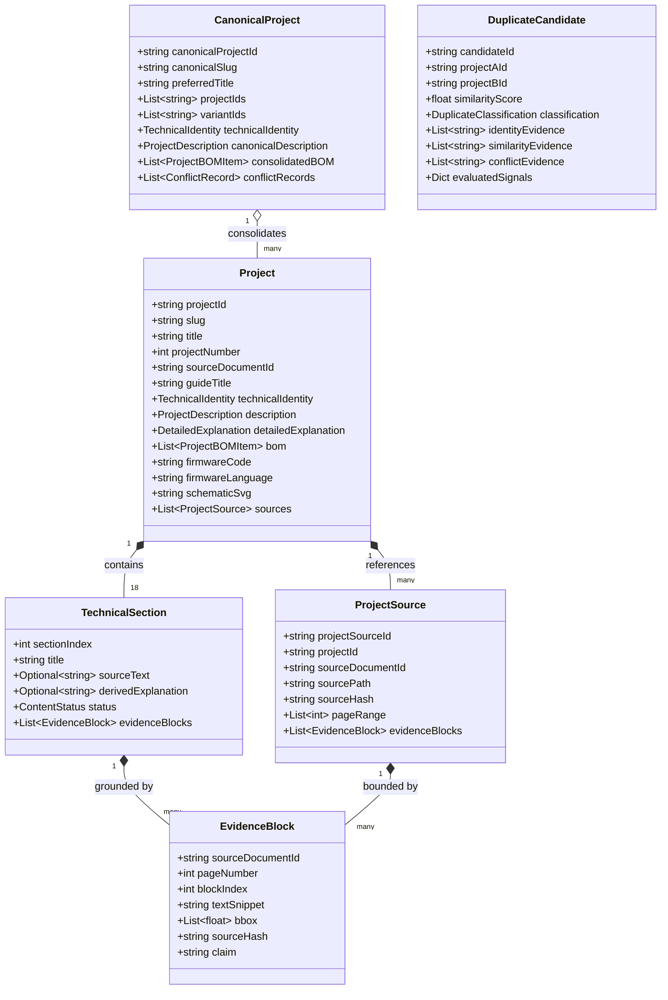

# EngineeringGuides: Project-First Architectural Specification (P02.1)

**Version:** 2.1.0  
**Status:** Certified & Released (Zero-Fabrication & Evidence-Provenance Recertified)  
**Standard:** $1\ \text{Technical Project} = 1\ \text{Independent Entity}$  

---

## 1. Executive Summary & Architectural Evolution (P02.1)

Following the initial Project-First architecture (P02), the **P02.1 Forensic Extraction, Evidence-Level Provenance & Zero-Fabrication Repair** initiative enforces absolute algorithmic rigor across the entire EngineeringGuides technical corpus:

1. **Forensic Boundary Determination:** Replaced any heuristic or proportional page division with IR-derived block parsing (`scripts/project_first/boundaries.py`), detecting explicit project headers (`[ P R O J E C T 0 1 ]`, `❯ project 01`, `PROJECT 1`, `UPGRADE 01`, `#1`) and layout continuity across all 31 documentary guides.
2. **Evidence-Level Provenance (`EvidenceBlock`):** Every non-null `sourceText` string in every technical section is backed by an `EvidenceBlock` referencing `sourceDocumentId`, `pageNumber`, `blockIndex`, `bbox`, `textSnippet`, `sourceHash`, and `claim`.
3. **Four-Way Content Separation:** Strict taxonomy separates:
   - `SOURCE`: Literal unmodified text extracted from Document IR with verified bounding boxes.
   - `DERIVED`: Algorithmic or structured inferences grounded strictly in evidence.
   - `NOT_DOCUMENTED`: Sections with zero documentary evidence in the source PDF (`sourceText: null`).
   - `UNVERIFIED`: Data points (e.g. BOM pricing) not independently audited.
4. **Zero Fabrication Guarantee:** No placeholder strings (such as *"Información técnica estructurada"* or *"Pendiente de verificación"*) are permitted in source fields.
5. **Strict Identity-Evidence Deduplication:** Merges into `CanonicalProject` require unambiguous identity evidence (matching project/guide identity, shared vector schematics, or $\ge 70\%$ literal title overlap). Shared controllers or BOM components alone are forbidden from causing merges (**FALSE NEGATIVE > FALSE MERGE**).
6. **Exhaustive Pairwise Evaluation:** All $\frac{183 \times 182}{2} = 16,653$ candidate pairs are evaluated exhaustively in under 6 seconds, eliminating lossy heuristic candidate filtering.

---

## 2. Domain Data Model & Evidence Provenance

---

## 3. Tiered Executable Golden Dataset

Verification is guaranteed through four tiers of executable calibration:
- **Golden-1:** Controlled single-project deep forensic audit (`guide-001 #1` *Digital Night-Vision Monocular*, `proj-9cc1a42f66e7c4d5`).
- **Golden-5:** Five diverse engineering domains (Optics/Vision, UAV/Robotics, Aerospace/Propulsion, SDR/RF, Motion Control).
- **Golden-20:** Twenty cross-guide representative projects auditing full schema and evidence fields.
- **Full-183:** Complete corpus forensic sweep validating zero fabrication and 100% boundary reconciliation.

---

## 4. 10 Strict Project-First Validator Checks

The `ProjectFirstValidator` runs 10 mandatory checks:
1. **CHECK 1: Schema:** Pydantic validation of `ProjectCatalog` v2.1.0, `CanonicalProject`, `DuplicateCandidate`, `ProjectRelation`.
2. **CHECK 2: Source Hash Integrity:** Every project occurrence SHA-256 matches `source_manifest.json`.
3. **CHECK 3: Evidence Provenance:** Every non-null `sourceText` has valid `EvidenceBlock` entries.
4. **CHECK 4: Zero Fabrication Gate:** 0 placeholder strings, 0 unevidenced `SOURCE` claims.
5. **CHECK 5: Boundary Integrity:** 183 IR-derived boundaries verified in `boundary_reconciliation.json`.
6. **CHECK 6: Deduplication Integrity:** 16,653 pairs evaluated, 0 false merges, exact duplicate definition strictly enforced.
7. **CHECK 7: Source Preservation:** 31/31 PDFs intact, non-empty, matching manifest SHA-256.
8. **CHECK 8: Structured Description Integrity:** *¿Qué es?, ¿Qué hace?, ¿Para qué sirve?* present and grounded.
9. **CHECK 9: Golden Dataset Execution:** Golden-1, Golden-5, Golden-20, Full-183 pass.
10. **CHECK 10: Determinism:** Byte-for-byte serialization idempotency.
