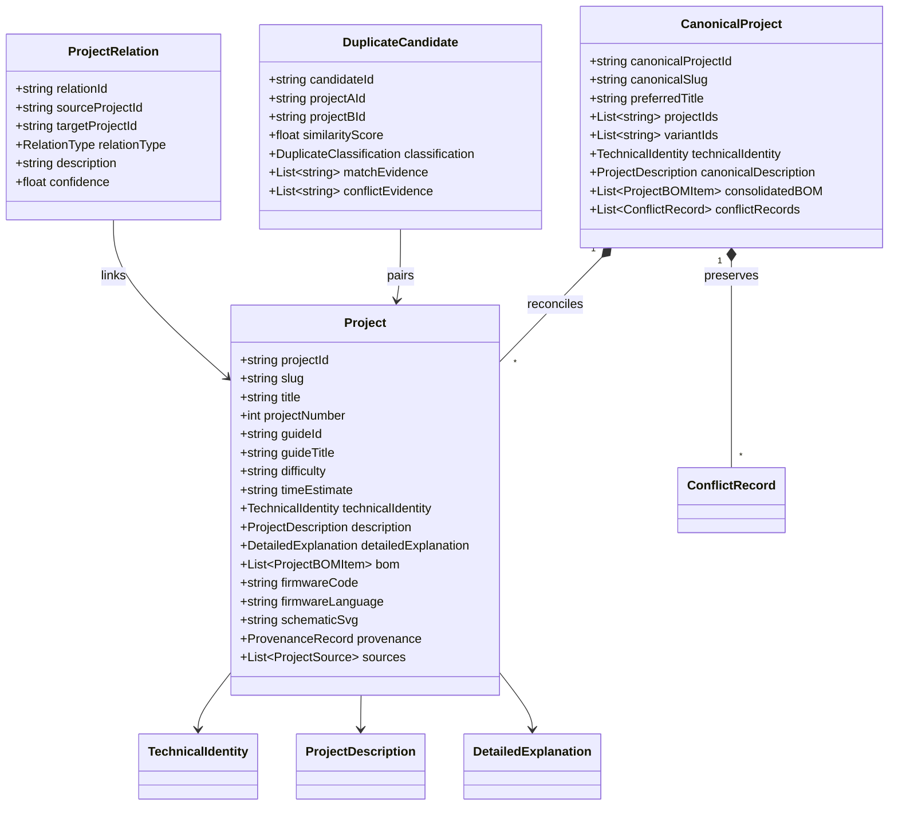

# EngineeringGuides: Project-First Architectural Specification (P02)

**Version:** 2.0.0  
**Status:** Certified & Released  
**Standard:** $1\ \text{Technical Project} = 1\ \text{Independent Entity}$  

---

## 1. Executive Summary & Architectural Shift

EngineeringGuides was originally designed as a document-centric guide viewer where 31 PDF files were treated as the primary domain entities. Under that model, individual technical projects were merely nested sub-sections of guides.

**Prompt 02: Project-First Architecture** enacts a paradigm shift:
- **Project as First-Class Citizen:** Every distinct technical project is instantiated as an independent entity (`Project`) with its own canonical identifier, URL slug, deterministic SHA-256 identity, bill of materials, firmware, and 18 adaptable technical sections.
- **Bi-directional Traceability:** While projects are independent, 100% of documentary provenance is preserved: `Project` $\rightarrow$ `ProjectSource` $\rightarrow$ `SourceDocument` $\rightarrow$ `Page` $\rightarrow$ `Evidence`.
- **Zero Fabrication Invariant:** No component values, prices, pinouts, or technical specifications are hallucinated.
- **Cardinal Deduplication Rule:** **FALSE NEGATIVE > FALSE MERGE**. It is vastly safer to treat two identical projects as distinct/unlinked than to prematurely merge distinct projects.

---

## 2. Domain Data Model

---

## 3. Deterministic Identity Generation

Identifiers must remain identical across runs and environments without relying on database auto-increments or non-deterministic UUIDv4.

- **Project ID (`proj-...`):**  
  `SHA-256("proj:" + guideId + ":" + projectNumber + ":" + normalizedTitle)[:16]`
- **Project Source ID (`psrc-...`):**  
  `SHA-256("psrc:" + projectId + ":" + guideId + ":" + pageRange)[:16]`
- **Canonical Project ID (`cproj-...`):**  
  `SHA-256("cproj:" + sorted(projectIds).join(","))[:16]`
- **Duplicate Candidate ID (`cand-...`):**  
  `SHA-256("cand:" + min(pA, pB) + ":" + max(pA, pB))[:16]`
- **Project Relation ID (`rel-...`):**  
  `SHA-256("rel:" + type + ":" + pA + ":" + pB)[:16]`
- **Conflict Record ID (`conf-...`):**  
  `SHA-256("conf:" + fieldPath + ":" + pA + ":" + pB)[:16]`

---

## 4. Multi-Signal Deduplication Taxonomy

Every pair of projects is scored across five orthogonal signals:
1. **Title Token Jaccard Similarity** ($S_{\text{title}} \in [0, 1]$)
2. **Duplicate Source Document Relationship** ($S_{\text{doc}} \in \{0, 1\}$)
3. **Microcontroller / Core Controller Match** ($S_{\text{mcu}} \in \{0, 1\}$)
4. **Schematic Vector Graph Equivalence** ($S_{\text{schem}} \in \{0, 1\}$)
5. **BOM Component Overlap** ($S_{\text{bom}} \in [0, 1]$)

### 6-Class Classification Matrix:
- `EXACT_DUPLICATE`: $S_{\text{title}} = 1.0$ AND ($S_{\text{doc}} = 1$ OR $S_{\text{schem}} = 1$). Proof of identical design.
- `PROBABLE_DUPLICATE`: $S_{\text{composite}} \ge 0.85$ with identical title and overlapping BOM.
- `VARIANT`: Same core circuit and function, but differing MCU, power stage, or packaging.
- `RELATED`: Same application family, ecosystem, or shared bus protocol.
- `UNRELATED`: Distinct physical function or hardware architecture ($S < 0.35$).
- `NEEDS_REVIEW`: High title similarity but conflicting hardware components, or duplicate guide with differing extracted titles. **NEVER auto-merged.**

---

## 5. The 18 Adaptable Technical Sections

Every project presents 18 dedicated technical dimensions, preserving exact source extractions and derived engineering explanations:
1. **Descripción general** (`overview`)
2. **¿Qué hace?** (`whatDoesItDo`)
3. **¿Para qué sirve?** (`whatIsItFor`)
4. **Objetivo técnico** (`objective`)
5. **Arquitectura del sistema** (`architecture`)
6. **Hardware y subsistemas principales** (`hardware`)
7. **Componentes críticos y especificaciones** (`components`)
8. **Alimentación y gestión de energía** (`power`)
9. **Conexiones y pinout clave** (`connections`)
10. **Lógica de control y firmware** (`firmware`)
11. **Configuración y parámetros de ajuste** (`configuration`)
12. **Principio de funcionamiento físico/lógico** (`operation`)
13. **Ensamblaje e integración paso a paso** (`assembly`)
14. **Puesta en marcha y verificación inicial** (`commissioning`)
15. **Modos de uso y casos prácticos de despliegue** (`usage`)
16. **Limitaciones técnicas y casos de borde** (`limitations`)
17. **Seguridad técnica y precauciones operativas** (`safety`)
18. **Documentación original y trazabilidad** (`sources`)

---

## 6. Anti-False-Merge Guards

The system rigorously rejects merging under any of the following conditions:
1. **Controller Disagreement:** E.g., `ESP32` vs `STM32` vs `RP2040`.
2. **Primary Sensor Disagreement:** E.g., `IMX307` vs `OV2640`.
3. **Different Guide Extraction without Bit-Level Duplicate Guide Proof.**
4. **Any ambiguous candidate is marked `NEEDS_REVIEW` and maintained as distinct projects.**