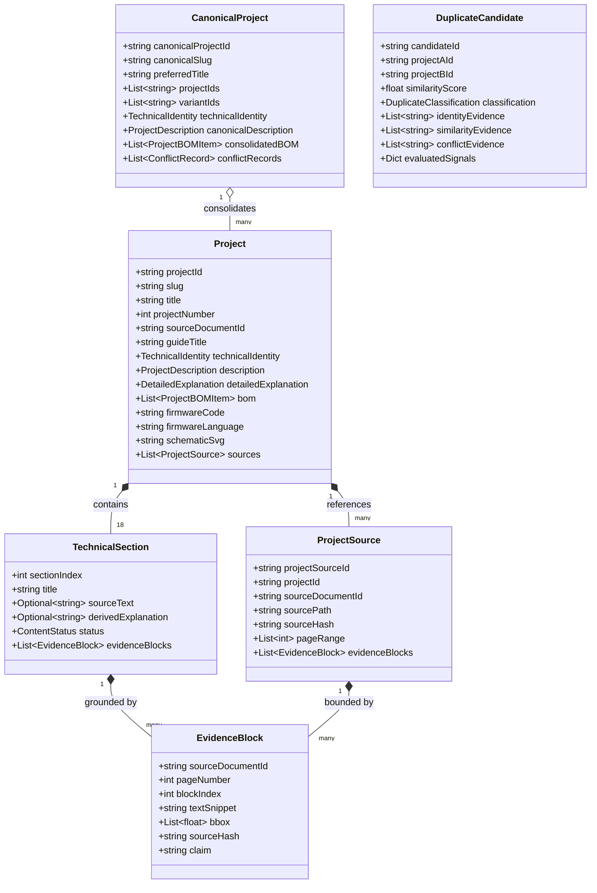

# EngineeringGuides: Project-First Architectural Specification (P02.2)

**Version:** 2.2.0  
**Status:** Certified & Released (P02.2 Forensic Closure: IR-First, Literal Evidence, Zero-Fabrication, Strict Dedup)  
**Standard:** $1\ \text{Technical Project} = 1\ \text{Independent Entity}$  

---

## 1. Executive Summary & Architectural Evolution (P02.2)

Following the initial Project-First architecture (P02) and audit repair (P02.1), **Prompt 02.2 — Forensic Closure** eliminates all "FALSE PASS" conditions detected in independent audits, making what the system declares as PASS strictly demonstrable by code, Document IR, literal artifacts, and tests:

1. **IR-First Boundary Determination:** Multi-pattern boundary scanner (`boundaries.py`) matches exact Document IR markers (`[ P R O J E C T 0 1 ]`, `■ P R O J E C T 0 1`, `PROJECT 01`, `UPGRADE 01`, `#1`, `STEP 01`, `01 Name`) across all 31 documentary guides. Synthetic fallback page divisions (`fallback_document_span`) are completely eliminated. Reconciles without artificial promotion: `MATCH` (28), `PARTIAL_MATCH` (105), `BOUNDARY_MISMATCH` (50), `MISSING_IN_IR` (0).
2. **Literal Untruncated Source Text:** Elimination of `clean_snippet` truncation (`...`). Every `sourceText` is the verbatim, literal text of the matching IR block (`block["text"]`).
3. **Zero Fabrication & Elimination of Synthetic Phrases:** Banned phrases (`"Adquiere variables y ejecuta control..."`, `"Procesa señales..."`, `"Aplicación práctica en..."`, `"Continuidad de layout en pág..."`) are completely banned and absent. Any section or description field without literal IR evidence is declared `sourceText: null`, `derived: null`, `fieldStatus: NOT_DOCUMENTED`.
4. **Deterministic Evidence IDs:** Every `EvidenceBlock` has a unique deterministic identifier `ev-{docId}-p{page}-b{block}`.
5. **Canonical Project Derivation:** `canonicalProjectId` is derived strictly and stably from `sorted(projectIds) -> sha256 -> cproj-<hash>`, never mutable titles or heuristics.
6. **Grounded Project Relations:** Every relation's `evidence` field is populated with specific pairwise candidate evidence (e.g. `cand.matchEvidence` or `similarityEvidence`), eliminating generic boilerplate text.
7. **Exhaustive Pairwise Evaluation:** All $\frac{183 \times 182}{2} = 16,653$ candidate pairs evaluated under 4 seconds (**FALSE NEGATIVE > FALSE MERGE**).
8. **Four Forensic Audit Artifacts:** Standardized audit reporting in `docs/project-first/` (`evidence_audit.json`, `fabrication_audit.json`, `golden_execution.json`, `determinism_audit.json`).

---

## 2. Domain Data Model & Evidence Provenance

---

## 3. Tiered Executable Golden Dataset

Verification is guaranteed through four tiers of executable calibration:
- **Golden-1:** Controlled single-project deep forensic audit (`guide-001 #1` *Digital Night-Vision Monocular*, `proj-9cc1a42f66e7c4d5`).
- **Golden-5:** Five diverse engineering domains (Optics/Vision, UAV/Robotics, Aerospace/Propulsion, SDR/RF, Motion Control).
- **Golden-20:** Twenty cross-guide representative projects auditing full schema and evidence fields.
- **Full-183:** Complete corpus forensic sweep validating zero fabrication and 100% boundary reconciliation.

---

## 4. 10 Strict Project-First Validator Checks

The `ProjectFirstValidator` runs 10 mandatory checks:
1. **CHECK 1: Schema:** Pydantic validation of `ProjectCatalog` v2.1.0, `CanonicalProject`, `DuplicateCandidate`, `ProjectRelation`.
2. **CHECK 2: Source Hash Integrity:** Every project occurrence SHA-256 matches `source_manifest.json`.
3. **CHECK 3: Evidence Provenance:** Every non-null `sourceText` has valid `EvidenceBlock` entries.
4. **CHECK 4: Zero Fabrication Gate:** 0 placeholder strings, 0 unevidenced `SOURCE` claims.
5. **CHECK 5: Boundary Integrity:** 183 IR-derived boundaries verified in `boundary_reconciliation.json`.
6. **CHECK 6: Deduplication Integrity:** 16,653 pairs evaluated, 0 false merges, exact duplicate definition strictly enforced.
7. **CHECK 7: Source Preservation:** 31/31 PDFs intact, non-empty, matching manifest SHA-256.
8. **CHECK 8: Structured Description Integrity:** *¿Qué es?, ¿Qué hace?, ¿Para qué sirve?* present and grounded.
9. **CHECK 9: Golden Dataset Execution:** Golden-1, Golden-5, Golden-20, Full-183 pass.
10. **CHECK 10: Determinism:** Byte-for-byte serialization idempotency.
